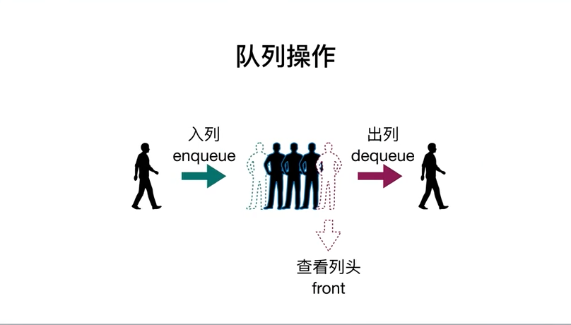
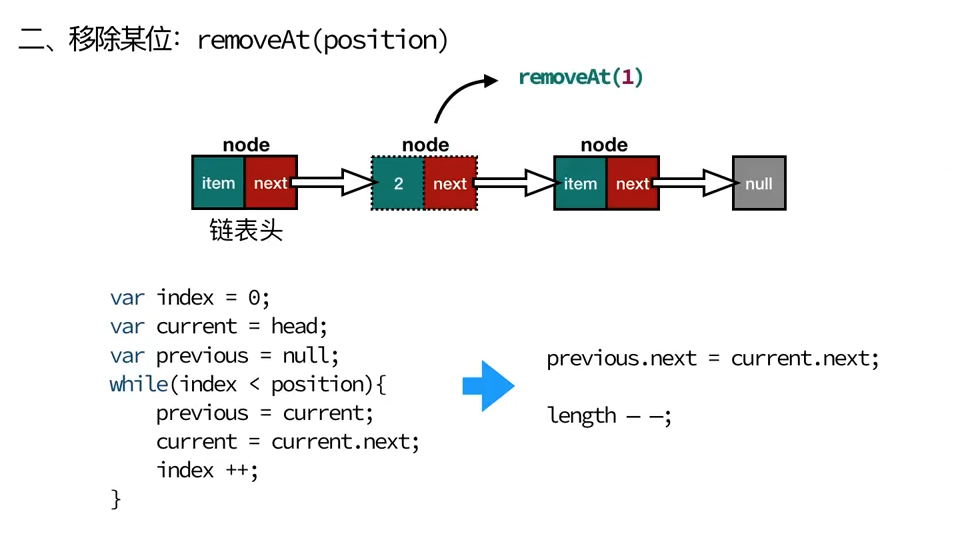

## 数据结构
### 栈(Stack)：一种后进先出（LIFO）的数据结构;
代表性例子，页面跳转
peek 检查栈顶是什么东西

### 队列(Queue)：一种先进先出（FIFO）的数据结构;

优先队列(priorityQueue)

### 链表(LinkedList)

加强链表--双向链表

加强链表--双向循环链表

### 集合的特性和概念
1. 无重复性
2. 空集
3. 子集
并集（Union）交集（Intersect）差集（Difference）

### Set
es6提供set数据结构，它类似于数组，但是成员的值都是唯一的，没有重复的值
set函数可以接受一个数组（或者具有 iterable 接口的其他数据结构）作为参数，用来初始化。
Set 加入值时认为NaN等于自身
- size 返回Set实例的成员总数。
- add(value) 添加某个值，返回Set结构本身
- delete(value) 删除某个值，返回一个布尔值，表示删除是否成功
- has(value) 返回一个布尔值，表示该值
- clear() 清除所有成员，没有返回值
遍历操作
- keys() 返回键名的遍历器
- values() 返回键值的遍历器
- entries() 返回键值对的遍历器
- forEach() 使用回调函数遍历每个成员
### WeckSet
WeckSet结构与Set类似，也是不重复的值的集合。和Set有两个区别。
区别：
1. WeakSet的成员只能是对象，而不能是其他类型的值。
2. WeakSet中的对象是弱引用，垃圾回收机制不考虑WeakSet对该对象的引用。
- add(value) 向WeakSet实例添加一个新成员。
- delete(value) 清除WeakSet实例指定成员。
- has(value) 返回一个布尔值，表示某个值是否存在WeakSet实例之中。
应用场景：WeakSet的一个用处，是存储DOM节点，而不用担心这些节点从文档移除时，会引发内存泄露
### 字典 Dictionary
类似集合的数据结构
### Map
ES6 提供了 Map 数据结构。它类似于对象，也是键值对的集合，但是”键“可以是任何类型，是一种更完善的Hash结构实现。
- size属性返回Map结构的成员总数
- set(key,value) set方法设置键名key对应的键值为value，然后返回整个Map结构。如果key已经有值，则键值会被更新，否则就生成该键。
- get(key) get方法读取key对应的键值，如果找不到key，返回undefined。
- has(key) has方法返回一个布尔值，表示某个键是否在当前Map对象之中。
- delete(key) delete方法删除某个键，返回true。如果删除失败，返回false。
- clear() 清除所有成员，没有返回值。
遍历方法
keys() 返回键名的遍历器
values() 返回键值的遍历器
entries() 返回所有成员的遍历器
forEach() 遍历Map的所有成员
### WeakMap 
WeakMap结构与Map结构类似，也是用于生成键值对的集合。 
与Map区别：
- WeakMap只接受对象作为键名（null除外），不接受其他类似的值作为键名。
- WeakMap的键名所指的对象，不计入垃圾回收机制。
应用场景：在网页的 DOM 元素上添加数据，就可以使用WeakMap结构。当该 DOM 元素被清除，其所对应的WeakMap记录就会自动被移除。
### 散列表（哈希表）
散列表会有冲突的情况
使用**分离链接法** **线性探查法** 解决冲突

### 树结构

### 图结构
有向图，无向图

邻接矩阵

邻接表

### 堆
用数组实现二叉树